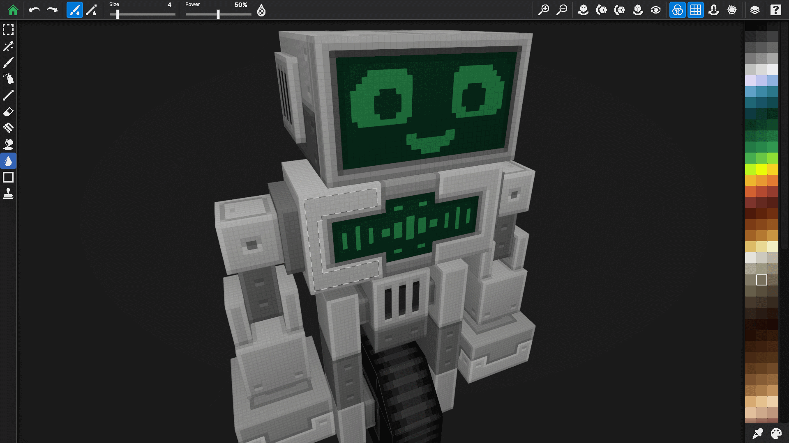
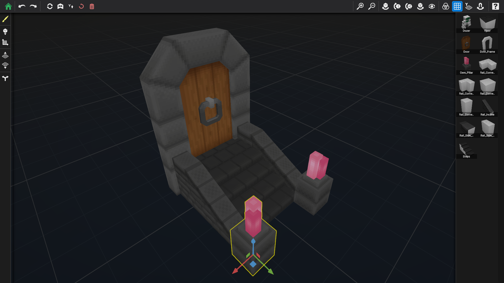
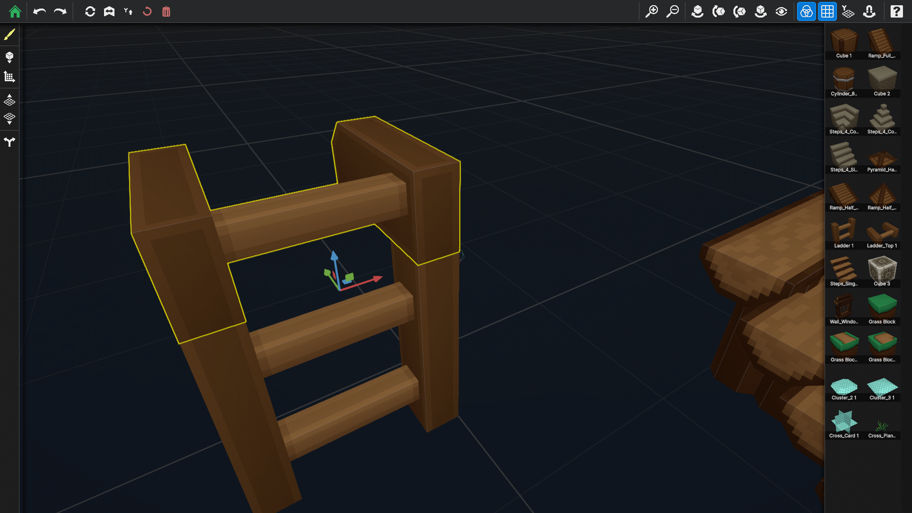
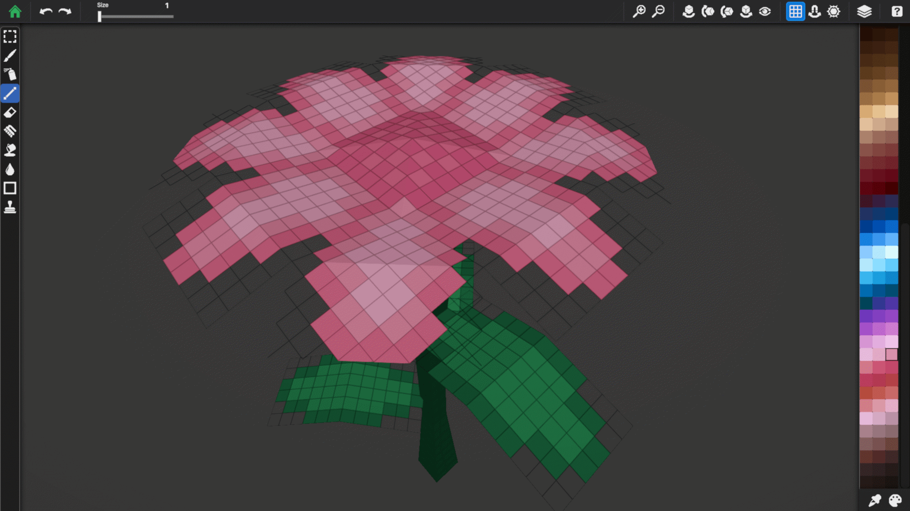
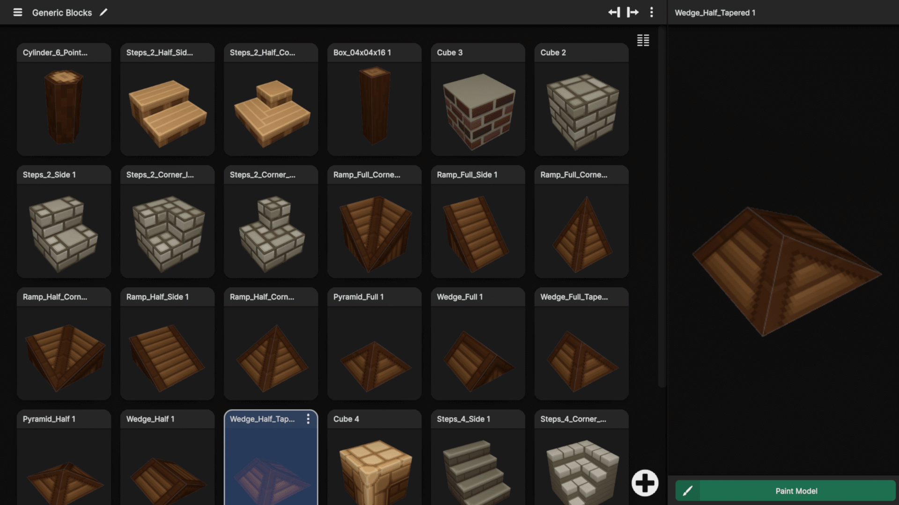
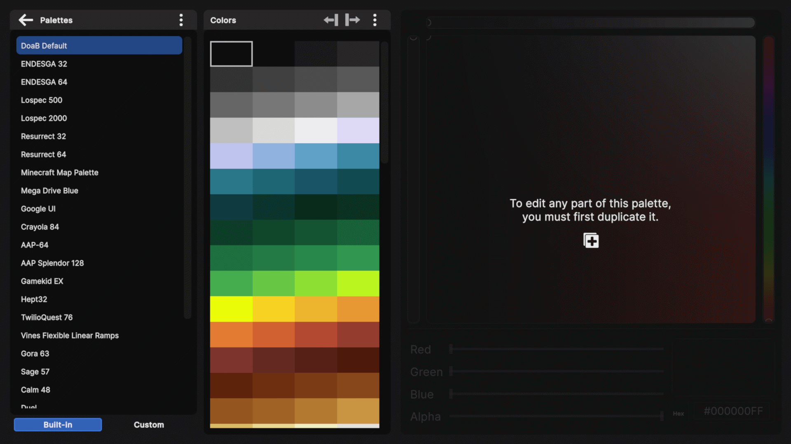

# Draw on a Block

**Paint directly on 3D models with pixel-perfect precision.**

[-blue.svg)](#platforms)

---

## Overview

**Draw on a Block** is a 3D pixel art painting application where you paint textures directly onto 3D model surfaces — your brush snaps to the exact pixel, no 2D editor required.

But it's more than a painting tool. With the **Scene Builder**, you arrange your painted models into full 3D scenes on a grid-based workspace — place blocks, stack them, rotate and flip, duplicate with a drag. Then press **Tab** to enter the **Scene Painter** and paint any model right where it sits, without leaving the scene. All instances of a model update live. Need one to look different? **Fork** it to create an independent copy with its own textures. Switch back and forth between building and painting as much as you want.

Whether you're creating Minecraft block textures, prototyping game levels, building pixel art dioramas, or just having fun, Draw on a Block gives you an intuitive, all-in-one workflow from first brushstroke to finished scene.

📖 **[Full User Guide](docs/USER_GUIDE.md)** — Detailed documentation for every feature

---

## Videos

| | |
|-|-|
|||
|||

---

## Screenshots

| | |
|-|-|
|||
|||
|||
|||

---

## Key Features

### 🎨 Model Painter

Paint directly on 3D model faces with pixel-accurate brush placement. Nearest-neighbor filtering preserves crisp pixel art at all zoom levels.

| Tool | Description |
|------|-------------|
| **Brush** | Variable size (1–100px) with quadratic slider for fine control at small sizes |
| **Spray Paint** | Randomized dot patterns in an adjustable radius |
| **Line** | Pixel-perfect straight lines between two points |
| **Shapes** | Rectangle and circle (hollow or filled) |
| **Fill** | Flood fill, color replace, linear gradient, and radial gradient |
| **Pen Eraser** | Erase individual pixels |
| **Face Eraser** | Clear an entire face in one click |
| **Blend** | Smooth colors with adjustable strength; brush and line modes |
| **Selection** | Rectangular select with copy, paste, flip, rotate, and scale handles |
| **Magic Wand** | Select contiguous pixels of the same color; Shift to add, Ctrl to subtract |
| **Stamp** | Place decals from the Decal Library onto model surfaces |
| **Color Picker** | Sample any color from the model (hold Alt with any tool) |

Additional view controls: **Camera Filter** (toggle matcap/cavity shading), **Texel Grid** overlay, **Rotation Snap**, **Focus Mode** (isolate a single face), and **Explode** (separate multi-part models).

### 🗂️ Layer System

- Unlimited layers per material (limited only by hardware)
- **Blend modes:** Normal, Multiply, Screen
- **Per-layer opacity** slider (0–100%)
- Full undo/redo for all layer operations
- Real-time compositing with transparency preview
- Multi-material models maintain independent layer stacks

### 🎨 Palette System

- **Built-in palettes** — Curated palettes from the community (Endesga, Lospec, and more)
- **Custom palettes** — Create, duplicate, rename, and delete your own
- **Full color editor** — HSV picker square, hue slider, RGBA sliders (0–255 with alpha), and hex input
- **Import formats:** PNG, JASC PAL, ASE, GPL, HEX (up to 512 colors)
- **Export format:** HEX (one color per line)
- **Live color picker** — Sample colors from the model; picked colors not in the palette appear as a temporary swatch you can add with one click

### 🏗️ Scene Builder

Build 3D scenes by arranging your painted models on a grid-based workspace:

- **Grid-based placement** — Place Single or Paint Area mode to fill rectangular regions
- **Multi-axis grid** — Y (floor), X, or Z axis for platformers, sidescrollers, and more
- **Stacking** — Place models on top of existing ones; occupancy-aware grid
- **Move widget** — Drag to reposition; Shift+drag for fine-snap; Ctrl+drag to duplicate
- **Rotation & flipping** — 90° rotation, incremental rotation (configurable, default 15°), flip, and independent transform axis (Y/Z/X)
- **Per-scene settings** — Height step, texel density, and incremental rotation angle
- **Forking** — Create independent texture copies so you can paint unique variations without affecting other instances
- **Scene Painter** — Press Tab to switch to painting mode with the full toolset, then Tab again to return to building

### 📦 Model Import & Export

**Import** your own 3D models — one at a time or several at once:

- **Supported formats:** FBX, OBJ, GLTF, GLB, BBModel (Blockbench)
- Multi-file picker for batch import
- Two-phase flow: choose files, then configure all materials at once (UV resolution, opaque/translucent)
- Blockbench layer preservation with optional flatten toggle
- Auto-detect textures and resolutions from source files

**Export** painted models as textures or 3D files:

- Export one or multiple models at once
- **Merge Layers** — flatten to a single texture, or export each layer as a separate PNG
- **Export Models** — include 3D model files (GLTF, OBJ, or BBModel) alongside textures
- **Zip Exports** — bundle each model's output into a ZIP archive
- File conflict handling with Rename or Overwrite options
- All exports licensed for personal and commercial use

### 📸 Snapshot & Share

- **Static & animated capture** — PNG (transparent), JPG (solid background), GIF, APNG, MP4
- **Custom resolution** — Any size including 4K
- **Turntable animation** — Configurable rotation and duration
- **Camera controls** — Adjust angle, zoom, and background
- **Quick capture** — Ctrl+PrintScreen copies a 4K screenshot from the Model Painter

### 🖼️ Decal Library

Pre-made images you can stamp onto your models — perfect for eyes, faces, patterns, and details:

- Import one or more image files as decals
- Rename, export, delete, and reorder decals
- Multi-select with Ctrl+Click, Shift+Click, or marquee drag
- Grid and compact view modes
- Access from the Stamp tool (stamp mode) or Menu > Decal Library (browse-only mode)

### 📁 Project Manager

Manage separate projects — each with its own set of models and textures:

- Tile grid sorted by most recently modified
- Each tile shows project name, model count, last modified date, and thumbnail previews
- Create, open, rename, duplicate, and delete projects
- Multi-select with Ctrl+Click, Shift+Click, or marquee drag

### ✨ Quality of Life

- **Auto-save** on every change and on app pause
- **Full undo/redo** for all painting and layer operations
- **Customizable hotkeys** for every tool and action
- **Help Mode** — tap any icon to learn what it does
- **Texel grid overlay** shows pixel boundaries at any zoom
- **Marquee selection** in all tile grids (Models, Scenes, Decals, Projects)
- **Grid and compact views** for all tile grids
- **Tile hover menus** for quick rename, export, duplicate, delete, and more

---

## Platforms

| Platform | Status | Distribution |
|----------|--------|--------------|
| **Windows PC** | ✅ Supported | Steam |

---

## Target Audience

- **Minecraft Modders** — Block textures, mob skins, item sprites
- **Roblox Developers** — Avatar items, game props, accessories
- **Hytale Creators** — Voxel-style characters and environments
- **Indie Game Devs** — Rapid texture iteration, level prototyping with painted assets
- **Platformer/Sidescroller Devs** — Build levels on X or Z axis grids, export to your engine
- **Artists & Hobbyists** — 3D pixel art, scenes, creative projects

---

## Pricing

| Edition | Price | Features |
|---------|-------|----------|
| **Draw on a Block** | $29 (one-time) | Full app with all features, 50+ starter models, all painting tools, import/export, Scene Builder, Snapshot & Share |

---

## Roadmap

| Feature | Status |
|---------|--------|
| Multi-material painting | ✅ Complete |
| Layer system with blend modes | ✅ Complete |
| Layer undo/redo (all operations) | ✅ Complete |
| Blockbench import/export | ✅ Complete |
| glTF/GLB import/export | ✅ Complete |
| FBX/OBJ import/export | ✅ Complete |
| Scene Builder | ✅ Complete |
| In-Scene Painting | ✅ Complete |
| Multi-axis grid (X/Y/Z) | ✅ Complete |
| Move widget & surface placement | ✅ Complete |
| Snapping & incremental rotation | ✅ Complete |
| Model forking (Builder + Painter) | ✅ Complete |
| Marquee selection (all grids) | ✅ Complete |
| Steam integration | ✅ Complete |
| Custom JSON level export | ✅ Complete |
| Kitbashing | 📋 Planned |

---

## Technical Highlights

- **Engine:** Unity 6.2 with Universal Render Pipeline (URP)
- **Rendering:** Matcap + cavity shading for stylized model preview; Camera Filter toggle for flat color view
- **Input:** Mouse and pen support with fully customizable hotkeys
- **Pixel precision:** Raycast-based input snaps to texture pixel centers; nearest-neighbor filtering throughout
- **Storage:** Per-layer PNG persistence with orphan cleanup and trash folder recovery
- **Architecture:** Context-based per-model painting system with shared materials for scene instances

---

## Copyright & License

**© 2024-2026 Keith Fox. All Rights Reserved.**

Draw on a Block is proprietary software. This repository is provided for reference and copyright documentation purposes only.

- The source code, assets, and design documents in this repository are **not open source**.
- Redistribution, modification, or commercial use of any materials is **strictly prohibited** without explicit written permission.
- All exported content created by users within the application belongs to those users and may be used freely in personal and commercial projects.

### Establishing Priority

This repository serves as a dated public record of the Draw on a Block project, its features, architecture, and implementation. The commit history documents the development timeline and establishes authorship.

**First public commit:** January 2026
**Initial concept date:** 2024
**Author:** Keith Fox

---

## Contact

- **Support:** [To Be Added Later]
- **Business Inquiries:** [To Be Added Later]
- **Website:** [To Be Added Later]

---

## Acknowledgments

- [Endesga](https://lospec.com/palette-list/endesga-32) for the beautiful color palettes
- The Unity and GitHub communities for invaluable resources and support
- Our beta testers for their feedback and working for friendship points

---

*Draw on a Block — Is it a toy or a tool?*
