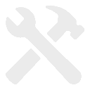

# Draw on a Block — User Guide

Welcome to **Draw on a Block**, a pixel painting app for 3D models! Paint directly on blocks, creatures, furniture, and more with intuitive tools designed for both PC and mobile.

---

## Table of Contents

1. [Getting Started](#getting-started)
2. [Common Interface Elements](#common-interface-elements)
3. [Project View](#project-view)
4. [Adding Models](#adding-models)
5. [Model Painter](#model-painter)
   - [Interface Overview](#interface-overview)
   - [Camera Controls](#camera-controls)
   - [Painting Tools](#painting-tools)
   - [Layers](#layers)
   - [Palettes](#palettes)
   - [Selections](#selections)
6. [Exporting Your Work](#exporting-your-work)
7. [Decal Library](#decal-library)
8. [Palette Manager](#palette-manager)
9. [Store & Pro Unlock](#store--pro-unlock)
10. [Settings](#settings)
11. [Keyboard Shortcuts (PC)](#keyboard-shortcuts-pc)
12. [Troubleshooting & FAQ](#troubleshooting--faq)

---

## Getting Started

When you first launch Draw on a Block, you'll see the **Project View** — your workspace for managing models.

### First Steps

1. Tap  **Add Model** to open the Model Catalog
2. Scroll through the catalog and select a model — you can expand/collapse categories as needed
3. Choose a texture resolution (higher = more detail, larger file size)
4. Your model appears in the project — tap it to start painting

### Quick Tips

- **Auto-save**: Your work is saved automatically as you paint and make changes
- **Undo mistakes**: Use the  undo button or `Ctrl + Z` (PC) to reverse changes
- **Get help**: Tap  in the Model Painter to enter Help Mode — then tap any icon to learn what it does

---

## Common Interface Elements

Many screens in Draw on a Block share similar layouts. Understanding these patterns will help you navigate the app quickly.

### Tile Grids

Throughout the app, you'll encounter grids of tiles for selecting models, palettes, decals, and more:

- **Tap** a tile to select it
- **Double-tap** (PC) or **single tap** (mobile) to open/activate the item
- **Long-press** (mobile) to enter multi-select mode
- **Hover** over a tile (PC) to reveal a  menu button in the top-right corner
- Tiles display a **thumbnail** and **name label**

#### Tile Hover Menu

Clicking the  button on a tile reveals a dropdown menu with quick actions:

-  **Rename** — Change the item's name
-  **Refresh Textures** — (PC only) Reload textures from disk after external editing
-  **Change Resolution** — Adjust the texture resolution
-  **Export** — Export the item
-  **Duplicate** — Create a copy
-  **Delete** — Remove the item

### Header Bars

Most screens have a header bar with:

-  **Menu** (top-left): Access navigation and settings
- **Title** (center): Current screen or project name
- **Action buttons** (top-right): Context-specific actions

### Popups and Overlays

Full-screen overlays (like Settings or Add Model) can be closed by:

- Tapping the  back button
- Pressing **Escape** (PC)

---

## Project View

The Project View is your home base for managing all models in your current project.

### What You Can Do

| Action | How |
|--------|-----|
| Open a model | Double-click (PC) or tap (mobile) |
| Select models | Click (PC) or long-press (mobile) |
| Add a model | Tap the  tile |
| Rename a model | Select it, then tap  in the selection menu |
| Delete models | Select and tap  in the selection menu |
| Duplicate models | Select and tap  in the selection menu |
| Reorder models | Drag tiles to new positions |
| Export models | Select and tap  in the selection menu |

### Menu Options

Tap  to access:

- **Project Manager** — Create, open, or manage projects
- **Store** — Browse and purchase model packs
- **Decal Library** — View available decals
- **Edit Palettes** — Manage color palettes
- **Open Project Folder** — (PC only) Open textures folder in File Explorer
- **Settings** — App preferences and controls
- **User Guide** — Opens this guide
- **Report Bug** — Send feedback to developers
- **Close Draw on a Block** — Exit the app

---

## Adding Models

The **Add Model** screen lets you browse and add models to your project.

### Using the Model Catalog

1. Open the catalog via  in Project View
2. Scroll through the catalog to browse models — tap category headers to expand or collapse them
3. Tap a model to see details
4. Choose your **texture resolution** (64×64 to 1024×1024 by default — you can customize available resolutions in Settings)
5. Tap **Add to Project** to confirm

### Importing Custom Models (Pro Feature)

With **Pro Unlock**, you can import your own 3D models.

**Supported formats**: FBX, OBJ, GLTF, GLB, BBModel (Blockbench)

#### Import Workflow

1. Tap **Import Model** in the Add Model screen
2. Select your model file from the file picker (if importing a bbmodel, you will be prompted to either merge layers or preserve layers)
3. The import screen appears with the following options:
   - **Import Textures** toggle — Enable to import textures from the model file (if available)
   - **UV Resolution** dropdown — Choose the texture resolution for each material
   - **Translucent/Opaque** toggle — Set whether materials support transparency
4. If the model has multiple materials, they appear in a list where you can configure each one individually
5. Tap **Finalize Import** to add the model to your project

> **Tip**: Ensure your model file's textures are located in the same folder as the model, or the textures may not import correctly.

#### Custom Models in the Model Catalog

Your imported models appear at the top of the Model Catalog. Hover over a custom model tile (PC) or long-press (mobile) to access the tile menu with these options:

-  **Rename** — Change the model's display name
-  **Configure Materials** — Adjust settings for each material:
  - **UV Resolution** — Change the texture resolution
  - **Translucent/Opaque** — Toggle transparency support
-  **Delete** — Permanently remove the source model

> **⚠ Warning**: Deleting a custom model from the catalog permanently removes it AND deletes every instance of that model from ALL of your projects — not just the current one. The app will show you how many models will be affected before confirming. Make sure to export anything you want to keep before deleting.

---

## Model Painter

The Model Painter is where you create your pixel art directly on 3D models.

### Interface Overview

#### PC Layout

The PC interface has three main areas:

- **Top Bar**: Contains the Home button (return to Project View), Undo/Redo buttons, tool selection buttons, view toggles (Grid, Explode, Rotation Snap), and the Help button
- **3D Viewport**: The main area where your model is displayed — this is where you paint
- **Palette Panel**: Displayed on the right side, shows your current color palette for quick color selection
- **Context Bar**: At the bottom of the screen, shows options specific to the currently selected tool (brush size, gradient colors, etc.)

#### Mobile Layout — Landscape

When holding your device horizontally:

- **Left Edge**: Vertical toolbar with all painting tools
- **Next to Toolbar**: Secondary toolbar (tools within toolbar category and other settings like brush size)
- **Top-Right**: Home, Help, and Layer buttons
- **Right Center**: Vertical palette strip for quick color selection
- **Top-Right**: Zoom +/- buttons
- **Bottom-Right**: Layer, Palette Manager, and Undo/Redo buttons

#### Mobile Layout — Portrait

When holding your device vertically:

- **Top Center**: Horizontal palette
- **Top-Left Corner**: Undo/Redo, and Color Picker and Palette Manager buttons
- **Top-Right Corner**: Home, Help, and Layer buttons
- **Top-Right**: Zoom +/- buttons
- **Bottom Edge**: Horizontal toolbar with all painting tools
- **Above Toolbar**: Secondary toolbar (tools within toolbar category and other settings like brush size)

### Camera Controls

Navigate around your model to paint from any angle:

| Platform | Rotate | Zoom | Pan |
|----------|--------|------|-----|
| **PC** | Left-click + drag | Scroll wheel | Middle-click + drag |
| **Mobile** | One finger drag | Pinch | Two finger drag |

#### View Options

-  **Grid**: Toggle texel grid overlay to see pixel boundaries
-  **Explode**: Separate model parts for easier painting (if supported)
-  **Rotation Snap**: Snap camera rotation to 45° increments

---

### Painting Tools

Draw on a Block provides a variety of tools for creating pixel art. Select tools from the toolbar, then paint by clicking/tapping on the model.

#### Basic Tools

| Tool | Icon | Description |
|------|------|-------------|
| **Selection** |  | Select rectangular regions for copy/paste/transform |
| **Brush** |  | Paint pixels with the current color |
| **Eraser** |  | Remove pixels (make transparent) |
| **Fill** |  | Fill a face or selection with color |
| **Color Picker** |  | Sample a color from the model |

> **Tip (PC)**: Hold **Alt** to temporarily switch to the Color Picker while using any tool.

#### Shape Tools

| Tool | Icon | Description |
|------|------|-------------|
| **Line** |  | Draw straight lines between two points |
| **Rectangle (Hollow)** |  | Draw rectangular outlines |
| **Rectangle (Solid)** |  | Draw filled rectangles |
| **Circle (Hollow)** |  | Draw circular outlines |
| **Circle (Solid)** |  | Draw filled circles |

#### Advanced Tools

| Tool | Icon | Description |
|------|------|-------------|
| **Spray Paint** |  | Paint with randomized dot patterns |
| **Blend Brush** |  | Smooth colors by blending neighboring pixels |
| **Blend Line** |  | Create smooth color transitions along a line |
| **Linear Gradient** |  | Fill with a gradient between two points |
| **Radial Gradient** |  | Fill with a circular gradient from center outward |
| **Replace Color** |  | Replace all instances of one color with another on a face |
| **Face Eraser** |  | Erase an entire face at once |
| **Stamp** |  | Apply decals from your decal library |

#### Tool Options

Most tools have adjustable settings in the **Context Bar**:

- **Brush Size**: 1-16 pixels (use slider or +/- buttons)
- **Gradient Colors**: Two color boxes used by the gradient tools. Click a color box to assign it the currently selected palette color. Then choose a different color from the palette and click the other color box. The gradient will blend between these two colors.

---

### Layers

Layers let you organize your painting into separate, editable surfaces — just like in Photoshop or other image editors.

#### Why Use Layers?

- Paint details on separate layers without affecting base colors
- Toggle visibility to compare variations
- Merge layers when satisfied with the result

#### Layer Controls

Open the **Layer Window** by tapping  or pressing **L** (PC).

| Action | How |
|--------|-----|
| Add layer | Tap  in the layer toolbar |
| Delete layer | Select layer, tap  in the layer toolbar |
| Toggle visibility | Tap the  icon on the layer row |
| Rename layer | Double-tap the layer name or tap  in the layer toolbar |
| Reorder layers | Use  /  buttons in the layer toolbar |
| Merge down | Select layer, tap  in the layer toolbar |
| Duplicate layer | Select layer, tap  in the layer toolbar |
| View UV image | Tap  to see the flattened UV texture |
| Switch material | If your model has multiple materials, use the material dropdown to switch between them |

> **Note**: Each model supports up to **16 layers**. The bottom layer is the base; layers above are composited on top.

---

### Palettes

Palettes are collections of colors for quick access while painting.

#### Quick Palette (Model Painter)

The **Palette Panel** on the right side of the screen shows your active palette:

- Tap any color to select it as your brush color
- The selected color is highlighted with a border

#### Using the Color Picker

When you use the **Color Picker** tool to sample a color from your model:

- If the color exists in your palette, it becomes selected
- If the color is **not** in your current palette, it appears at the end of the palette with a  overlay
- Tap the plus icon to add the color to your palette
- If you're using a **built-in palette**, adding a color will create a duplicate in your **Custom** palettes that you can freely edit

#### Switching Palettes

1. Tap the  **Edit Palette** button to open the Palette Manager
2. Select a different palette from the list on the left
3. Close the Palette Manager — the new palette is now active

> For creating and editing palettes, see [Palette Manager](#palette-manager).

---

### Selections

Selections allow you to work on specific regions of your texture.

#### Making a Selection

1. Choose the **Selection Tool** ()
2. Click and drag on a face to define a rectangular region
3. A marching-ants border shows the selected area
4. Use the **scale handles** on the corners and edges to resize your selection

#### Magic Wand Selection

Use the  **Magic Wand** subtool to select all contiguous pixels of the same color:

1. With the Selection tool active, tap the Magic Wand button in the context bar
2. Tap on any pixel — all connected pixels of that color will be selected

#### Selection Actions

With an active selection, you can use the buttons in the selection context bar:

| Action | Shortcut (PC) | Icon | Description |
|--------|---------------|------|-------------|
| Magic Wand | |  | Select contiguous area of same color |
| Copy | `Ctrl + C` |  | Copy selected pixels to clipboard |
| Paste | `Ctrl + V` |  | Paste clipboard contents |
| Flip Horizontal | `Shift + H` |  | Mirror selection horizontally |
| Flip Vertical | `Shift + V` |  | Mirror selection vertically |
| Rotate CW | `Shift + W` |  | Rotate 90° clockwise |
| Rotate CCW | `Shift + Q` |  | Rotate 90° counter-clockwise |
| Save to Decals | |  | Save selection to Decal Library |
| Move | Arrow keys | | Nudge selection (Shift = 8px) |

#### Deselecting

- Click outside the selection
- Press **Escape**

---

## Exporting Your Work

Share your painted models by exporting them as images or 3D files.

### Export Screen

1. Select model(s) in Project View
2. Tap  **Export** in the selection menu
3. The Export screen appears showing:
   - A list of selected models with their materials and layer counts
   - **Merge Layers** toggle — When on, all layers are flattened into a single texture
   - **Export Models** toggle — When on, exports 3D model files along with textures
   - **Format dropdown** (when Export Models is on) — Choose GLTF, OBJ, or BBModel
   - **Zip Exports** toggle — Bundle output into a ZIP archive

4. Tap **Export** to save your files

> **Note**: If a file with the same name already exists in the destination folder, you'll be prompted to either overwrite or rename.

### Export Formats

| Format | Best For |
|--------|----------|
| **GLTF** | Web, game engines, universal compatibility |
| **OBJ** | Most 3D software |
| **BBModel** | Blockbench (preserves layers!) |

---

## Decal Library

Decals are pre-made images you can stamp onto your models — perfect for eyes, faces, patterns, and details.

### Using Decals

1. Select the **Stamp Tool** ()
2. The Decal Library opens (on PC) or select "Load from Library" (on mobile)
3. Browse and tap a decal, then tap **Copy to Clipboard**
4. A toast appears: "Click Face to Paste To"
5. Click/tap on a face to place the decal

### Managing Decals

| Action | How |
|--------|-----|
| Import decal | Tap  to import an image file as a new decal |
| Export decal | Select a decal and tap  in the selection menu |
| Delete decal | Select and tap  in the selection menu |

### Browsing Decals

Access the Decal Library from:
- **Stamp Tool** in Model Painter
- **Menu > Decal Library** in Project View (browse-only mode)

---

## Palette Manager

The Palette Manager is a full-featured color palette editor.

### Accessing the Palette Manager

- From **Project View**: Menu > **Edit Palettes**
- From **Model Painter**: Tap the  **Edit Palette** button

### Palette Tabs

At the bottom of the palette list, you'll find two tabs:

- **Built-in** — Pre-made palettes that come with the app (read-only)
- **Custom** — Your own palettes that you can freely edit

> **Note**: Built-in palettes cannot be modified. If you edit a built-in palette, a copy is automatically created in your Custom tab.

### Managing Palettes

| Action | How |
|--------|-----|
| Create palette | Tap  **New** |
| Duplicate palette | Select palette, tap  |
| Delete palette | Select palette, tap  (custom palettes only) |
| Rename palette | Edit the name field at the top |
| Import palette | Tap  **Import** |

### Editing Colors

With a palette selected:

1. Tap a color swatch to select it
2. Use the **HSV picker** or **RGB sliders** to adjust
3. Enter a **hex code** for precise colors
4. Tap  to add new colors
5. Use the **swap left/right** icons to reorder colors (dragging is not supported)

### Importing Palettes

Supported formats:
- **PNG** — Colors sampled from image
- **JASC PAL** — Paint Shop Pro format
- **ASE** — Adobe Swatch Exchange
- **GPL** — GIMP Palette
- **HEX** — Plain text hex codes (one per line)

---

## Store & Pro Unlock

The Store offers additional model packs and the **Pro Unlock** feature.

### Signing In

To sync your purchases across devices and platforms, sign in with your Google account:

1. Open **Menu > Store**
2. Tap **Sign In**
3. Complete the Google sign-in in your browser
4. Your purchases will now sync across all devices where you're signed in

> **Note**: On mobile (iOS/Android), you can purchase without signing in, but your purchases won't sync to other platforms. On PC (non-Steam), signing in is required to make purchases.

### Model Packs

- Browse themed collections (Furniture, Creatures, Vehicles, etc.)
- Each pack contains multiple models
- Purchase unlocks all models in the pack permanently

### Pro Unlock — $29

A one-time purchase that enables:

- ✅ **Import custom 3D models** (FBX, OBJ, GLTF, GLB, BBModel)
- ✅ **Import textures** with your models
- ✅ **Upscale/downscale** imported texture resolutions

### Restoring Purchases

If you reinstall or switch devices:

1. Open **Menu > Store**
2. Sign in with the same account you used to purchase
3. Your purchases will be restored automatically

---

## Settings

Customize Draw on a Block to fit your workflow.

### Display Settings

| Setting | Description |
|---------|-------------|
| **Cavity Shading** | Edge highlighting effect strength |
| **Matcap Intensity** | Lighting style intensity |
| **Rim Shadow** | Edge darkening effect |
| **Grid Colors** | Customize texel grid overlay colors |
| **Checkerboard** | Transparency indicator colors |

### Control Settings

| Setting | Description |
|---------|-------------|
| **Rotation Sensitivity** | Camera orbit speed |
| **Zoom Sensitivity** | Scroll/pinch zoom speed |
| **Pan Sensitivity** | Camera pan speed |
| **Double-Click Threshold** | Time window for double-click detection |
| **Long-Press Duration** | Hold time to trigger selection mode |

### Presets

- **UV Resolutions**: Customize available resolution options

### Hotkeys (PC Only)

Customize keyboard shortcuts for all tools and actions. See [Keyboard Shortcuts](#keyboard-shortcuts-pc) for defaults.

---

## Keyboard Shortcuts (PC)

All shortcuts can be customized in **Settings > Hotkeys**.

### General

| Action | Default |
|--------|---------|
| Undo | `Ctrl + Z` |
| Redo | `Ctrl + Y` or `Ctrl + Shift + Z` |
| Copy | `Ctrl + C` |
| Cut | `Ctrl + X` |
| Paste | `Ctrl + V` |
| Delete Selection | `Delete` |
| Cancel / Go Back | `Escape` |
| Approve / Commit | `Enter` |
| Zoom In | `Ctrl + +` |
| Zoom Out | `Ctrl + -` |
| Toggle Grid | `G` |
| Toggle Explode | `E` |
| Toggle Rotation Snap | `S` |
| Open Layer Window | `L` |
| Help Mode | `F1` |
| Switch to Previous Model | `Tab` |
| Color Picker (Hold) | `Alt` *(not customizable)* |

### Paint Tools

| Tool | Default |
|------|---------|
| Selection | `Ctrl + S` |
| Brush | `Ctrl + P` |
| Spray Paint | `Ctrl + A` |
| Line | `Ctrl + L` |
| Eraser | `Ctrl + E` |
| Scrub Brush | `Ctrl + Shift + E` |
| Fill | `Ctrl + F` |
| Replace Color | `Ctrl + Shift + F` |
| Linear Gradient | `Ctrl + G` |
| Radial Gradient | `Ctrl + Shift + G` |
| Blend Brush | `Ctrl + B` |
| Blend Line | `Ctrl + Shift + B` |
| Stamp (Decals) | `Ctrl + D` |
| Rectangle (Hollow) | `Ctrl + R` |
| Rectangle (Solid) | `Ctrl + Shift + R` |
| Circle (Hollow) | `Ctrl + O` |
| Circle (Solid) | `Ctrl + Shift + O` |

### Selection Transforms

| Action | Default |
|--------|---------|
| Flip Horizontal | `Shift + H` |
| Flip Vertical | `Shift + V` |
| Rotate CCW (90°) | `Shift + Q` |
| Rotate CW (90°) | `Shift + W` |
| Move Up (1px) | `↑` |
| Move Down (1px) | `↓` |
| Move Left (1px) | `←` |
| Move Right (1px) | `→` |
| Move Up (8px) | `Shift + ↑` |
| Move Down (8px) | `Shift + ↓` |
| Move Left (8px) | `Shift + ←` |
| Move Right (8px) | `Shift + →` |

---

## Troubleshooting & FAQ

### Common Issues

**Q: My painted changes disappeared!**  
A: Check that you're painting on the correct layer. Hidden layers won't show your work. Your work is auto-saved periodically. If you return to the Project View, your model's texture changes are saved automatically.

**Q: I can't paint on certain faces.**  
A: Check the following:
- Is the layer visible? Hidden layers can't be painted on.
- Do you have an active selection? Painting is confined to the selected area.

**Q: Colors look different when exported.**  
A: This is usually due to color space differences. Try exporting as PNG with the "sRGB" option if available in your target software.

**Q: Import isn't working (Pro feature).**  
A: Ensure your model file:
- Is a supported format (FBX, OBJ, GLTF, GLB, BBModel)
- Has valid UV mapping
- Isn't corrupted or password-protected
- Has its textures in the same folder as the model file (textures must be accessible)

### Getting Help

- **In-App Help**: Tap  in the Model Painter
- **Report Bugs**: Menu > **Report Bug** 
- **This Guide**: Menu > **User Guide**

### Contact

For additional support, visit our GitHub repository or community forums.

---

*Thank you for using Draw on a Block! Happy painting! 🎨*
