# Draw on a Block — User Guide

Welcome to **Draw on a Block**, a pixel painting app for 3D models! Paint directly on blocks, creatures, furniture, and more with intuitive tools designed for PC.

---

## Table of Contents

1. [Getting Started](#getting-started)
2. [Common Interface Elements](#common-interface-elements)
3. [Models Tab](#models-tab)
4. [Adding Models](#adding-models)
5. [Model Painter](#model-painter)
   - [Interface Overview](#interface-overview)
   - [Camera Controls](#camera-controls)
   - [Painting Tools](#painting-tools)
   - [Layers](#layers)
   - [Palettes](#palettes)
   - [Selections](#selections)
6. [Scenes Tab](#scenes-tab)
7. [Scene Builder](#scene-builder)
8. [Scene Painter](#scene-painter)
9. [Exporting Your Work](#exporting-your-work)
10. [Snapshot & Share](#snapshot--share)
11. [Decal Library](#decal-library)
12. [Palette Manager](#palette-manager)
13. [Settings](#settings)
14. [Keyboard Shortcuts (PC)](#keyboard-shortcuts-pc)
15. [Troubleshooting & FAQ](#troubleshooting--faq)

---

## Getting Started

When you first launch Draw on a Block, you'll see the **Models** tab — your workspace for managing models.

### First Steps

1. Tap  **Add Model** to open the Model Catalog
2. Scroll through the catalog and select a model — you can expand/collapse categories as needed
3. Choose a texture resolution (higher = more detail, larger file size)
4. Your model appears in the project — tap it to start painting

### Quick Tips

- **Auto-save**: Your work is saved automatically as you paint and make changes
- **Undo mistakes**: Use the  undo button or `Ctrl + Z` to reverse changes
- **Get help**: Tap  in the Model Painter to enter Help Mode — then tap any icon to learn what it does

---

## Common Interface Elements

Many screens in Draw on a Block share similar layouts. Understanding these patterns will help you navigate the app quickly.

### Tile Grids

Throughout the app, you'll encounter grids of tiles for selecting models, palettes, decals, and more:

- **Click** a tile to select it
- **Double-click** to open/activate the item
- **Hover** over a tile to reveal a  menu button in the top-right corner
- Tiles display a **thumbnail** and **name label**

#### Tile Hover Menu

Clicking the  button on a tile reveals a dropdown menu with quick actions:

- 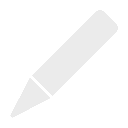 **Rename** — Change the item's name
-  **Refresh Textures** — Reload textures from disk after external editing (PC only)
-  **Change Resolution** — Adjust the texture resolution
-  **Export** — Export the item
-  **Duplicate** — Create a copy
-  **Take Snapshot** — Open the Snapshot & Share screen for this item
-  **Delete** — Remove the item

### Header Bars

Most screens have a header bar with:

-  **Menu** (top-left): Access navigation and settings
- **Title** (center): Current screen or project name
- **Action buttons** (top-right): Context-specific actions

### Popups and Overlays

Full-screen overlays (like Settings or Add Model) can be closed by:

- Tapping the 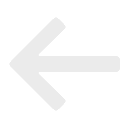 back button
- Pressing **Escape**

---

## Models Tab

The **Models** tab is your home base for managing all models in your current project. You can switch between the **Models** and **Scenes** tabs using the tab bar at the top.

### What You Can Do

| Action | How |
|--------|-----|
| Open a model | Double-click the model tile |
| Select a model | Click a model tile |
| Multi-select | `Ctrl + Click` to toggle individual tiles, `Shift + Click` for range selection |
| Marquee select | Click and drag on an empty area to draw a selection box |
| Add a model | Tap the  tile |
| Rename a model | Hover over a tile and tap  then  **Rename** |
| Delete models | Select, tap  in the selection toolbar, then  **Delete** |
| Duplicate models | Select, tap  in the selection toolbar, then  **Duplicate** |
| Export models | Select, tap  in the selection toolbar, then  **Export** |
| Reorder models | Select and use 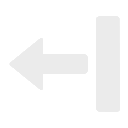 **Move Forward** /  **Move Backward** in the selection toolbar |
| Toggle view | Tap the view toggle button (top-right corner) to switch between grid and compact view |

### Menu Options

Tap  to access:

- **Project Manager** — Create, open, or manage projects
- **Decal Library** — View available decals
- **Edit Palettes** — Manage color palettes
- **Open Project Folder** — Open textures folder in File Explorer
- **User Guide** — Opens this guide
- **Settings** — App preferences and controls
- **Report Bug** — Send feedback to developers
- **Close Draw on a Block** — Exit the app

### Project Manager

The Project Manager lets you create, open, and manage separate projects — each project has its own set of models and textures.

1. Open it via  **Menu** > **Project Manager**
2. Projects appear in a tile grid sorted by most recently modified
3. Each tile shows the project name, model count, last modified date, and thumbnail previews

| Action | How |
|--------|-----|
| Create a project | Tap the  **New Project** button |
| Open a project | Select a project tile, then tap  **Open Project** — or double-click the tile directly |
| Rename a project | Hover over a tile and tap  then  **Rename** |
| Duplicate projects | Select, tap  in the selection toolbar, then  **Duplicate** |
| Delete projects | Select, tap  in the selection toolbar, then  **Delete** |
| Multi-select | `Ctrl + Click` to toggle, `Shift + Click` for range, or drag to marquee select |

> **Tip**: The default project name is "My Block Drawings". New projects are numbered automatically if a project with the same name exists.

---

## Adding Models

The **Add Model** screen lets you browse and add models to your project.

### Using the Model Catalog

1. Open the catalog via  in the Models tab
2. Scroll through the catalog to browse models — tap category headers to expand or collapse them
3. Tap a model to see details
4. Choose your **texture resolution** from the UV Resolution dropdown (64×64 to 1024×1024 by default — you can customize available resolutions in Settings)
5. Optionally toggle **Blank Texture** on to start with a blank canvas instead of the model's default starting textures
6. Tap **Add Model** to confirm

### Importing Custom Models

You can import your own 3D models — one at a time or several at once.

**Supported formats**: FBX, OBJ, GLTF, GLB, BBModel (Blockbench)

#### Import Workflow

1. Tap **Import Model** in the Add Model screen
2. The import screen opens. At the top is the **Import Textures** toggle (on by default) — this controls whether textures from the model files are imported
3. Click **Choose Models to Import** to open the file picker — you can select one or multiple model files at once
4. If any selected files are BBModel files, a popup appears with a **Flatten BlockBench Layers** toggle — turn it on to merge all layers into one, or leave it off to preserve them as separate layers
5. After parsing, all materials from all selected models appear in a single list. Each row shows the model name, material name, and auto-detected resolution
6. Use the **UV Resolution** dropdown and **Opaque/Translucent** toggle to configure materials. Select specific material rows first to change only those, or leave none selected to change all at once
7. Tap **Finalize Import** to add the model(s) to your project

> **Tip**: Ensure your model file's textures are located in the same folder as the model, or the textures may not import correctly.

#### Custom Models in the Model Catalog

Your imported models appear at the top of the Model Catalog. Hover over a custom model tile to access the tile menu with these options:

-  **Rename** — Change the model's display name
-  **Configure Materials** — Adjust settings for each material:
  - **UV Resolution** — Change the texture resolution
  - **Translucent/Opaque** — Toggle transparency support
-  **Delete** — Permanently remove the source model

> **⚠ Warning**: Deleting a custom model from the catalog permanently removes it AND deletes every instance of that model from ALL of your projects — not just the current one. The app will show you how many models will be affected before confirming. Make sure to export anything you want to keep before deleting.

---

## Model Painter

The Model Painter is where you create your pixel art directly on 3D models.

### Interface Overview

#### PC Layout

The PC interface has four main areas:

- **Top Bar** (horizontal, across the top): Home , Undo  / Redo , the **Subtoolbar** (context-sensitive buttons and sliders for the active tool), camera navigation buttons (zoom, rotate, reset), view toggles (Camera Filter, Grid, Rotation Snap, Focus Mode, Explode), Color Picker , Edit Palette , and Help 
- **Left Toolbar** (vertical, left side): All painting tools arranged in a single column — Selection, Magic Wand, Brush, Spray, Line, Pen Eraser, Face Eraser, Fill, Blend, Shape, and Stamp
- **3D Viewport** (center): The main area where your model is displayed — this is where you paint
- **Palette Panel** (right side): Shows your current color palette for quick color selection, plus the Layer button 

### Camera Controls

Navigate around your model to paint from any angle:

| Action | Control |
|--------|---------|
| **Rotate** | Right-click + drag |
| **Zoom** | Scroll wheel |
| **Pan** | Middle-click + drag |

#### View Options

These toggle buttons are in the top bar:

-  **Camera Filter**: Toggle matcap/cavity rendering effects for enhanced depth perception (on by default)
- 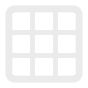 **Grid** (`G`): Toggle texel grid overlay to see pixel boundaries
-  **Rotation Snap** (`S`): Snap camera rotation to the nearest 45° angle when you release the mouse
- 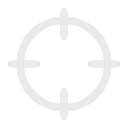 **Focus Mode** (`Ctrl + H`): Isolate a single face for distraction-free painting. Click the button to arm it, then click any face to zoom in and hide the rest of the model. Click again to exit.
-  **Explode** (`E`): Separate model parts for easier painting (available on supported multi-part models)

---

### Painting Tools

Draw on a Block provides a variety of tools for creating pixel art. Select tools from the **left toolbar**, then left-click on the model to paint.

Some tools in the left toolbar have **subtools** — when you select one, the **subtoolbar** (in the top bar) shows toggle buttons for its subtools. For example, selecting Fill shows buttons for Solid Fill, Color Replace, Linear Gradient, and Radial Gradient.

#### Left Toolbar (top to bottom)

| Tool | Icon | Description |
|------|------|-------------|
| **Selection** |  | Select rectangular regions for copy/paste/transform |
| **Magic Wand** |  | Select contiguous pixels of the same color |
| **Brush** | 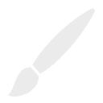 | Paint pixels with the current color |
| **Spray Paint** | 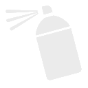 | Paint with randomized dot patterns in a radius |
| **Line** | 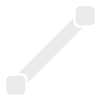 | Draw straight lines between two points |
| **Pen Eraser** |  | Erase individual pixels you touch |
| **Face Eraser** |  | Erase an entire face in one click |
| **Fill** |  | Fill tools (see subtools below) |
| **Blend** | 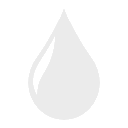 | Blend tools (see subtools below) |
| **Shape** | 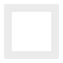 | Draw rectangles and circles (see subtools below) |
| **Stamp** |  | Open the Decal Library to apply a decal |

#### Color Picker

The Color Picker  is a toggle button in the **top bar** (not the left toolbar). Click it to enter picker mode, then click any pixel on the model to sample its color.

> **Tip**: Hold **Alt** to temporarily switch to the Color Picker while using any tool.

#### Fill Subtools

When **Fill** is selected, the subtoolbar shows:

| Subtool | Icon | Description |
|---------|------|-------------|
| **Solid Fill** |  | Flood-fill an area with solid color (default) |
| **Color Replace** |  | Replace all pixels of the clicked color on a face |
| **Linear Gradient** | 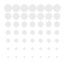 | Fill with a gradient between two points |
| **Radial Gradient** |  | Fill with a circular gradient from center outward |

When a gradient subtool is selected, two **color boxes** appear in the subtoolbar. Click a color box to assign it the currently selected palette color — the gradient blends between these two colors.

#### Blend Subtools

When **Blend** is selected, the subtoolbar shows:

| Subtool | Icon | Description |
|---------|------|-------------|
| **Blend Brush** | 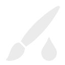 | Smooth colors by blending neighboring pixels |
| **Blend Line** | 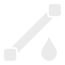 | Create smooth color transitions along a line |

Blend tools also show **Size** and **Strength** sliders, plus an **Include Transparent** toggle to control whether transparent pixels are included in the blend calculation.

#### Shape Subtools

When **Shape** is selected, the subtoolbar shows:

| Subtool | Icon | Description |
|---------|------|-------------|
| **Rectangle (Hollow)** |  | Draw rectangular outlines |
| **Rectangle (Solid)** |  | Draw filled rectangles |
| **Circle (Hollow)** |  | Draw circular outlines |
| **Circle (Solid)** | 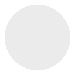 | Draw filled circles |

#### Subtoolbar Options

Many tools show a **size slider** in the subtoolbar for adjusting brush/tool size (1–100 pixels). The slider uses a quadratic curve for finer control at small sizes.

> **Tip**: Click on any slider's numeric value to type an exact number directly.

---

### Layers

Layers let you organize your painting into separate, editable surfaces — just like in Photoshop or other image editors.

#### Why Use Layers?

- Paint details on separate layers without affecting base colors
- Toggle visibility to compare variations
- Use blend modes to create lighting and shadow effects
- Merge layers when satisfied with the result

#### Layer Controls

Open the **Layer Window** by tapping  or pressing **L**.

| Action | How |
|--------|-----|
| Add layer | Tap  in the layer toolbar |
| Delete layer | Select layer, tap  in the layer toolbar |
| Toggle visibility | Tap the  icon on the layer row |
| Rename layer | Double-tap the layer name or tap  in the layer toolbar |
| Reorder layers | Use  /  buttons in the layer toolbar |
| Merge down | Select layer, tap  in the layer toolbar |
| Duplicate layer | Select layer, tap  in the layer toolbar |
| Toggle layer options | Tap 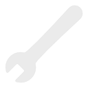 to reveal blend mode and opacity controls |
| Change blend mode | Use the blend mode dropdown (Normal, Multiply, Screen) |
| Change opacity | Use the opacity slider (drag to adjust 0–100%) |
| View UV image | Tap  to see the flattened UV texture |
| Switch material | If your model has multiple materials, use the material dropdown to switch between them |

> **Note**: The bottom layer is the base; layers above are composited on top. Layer count is limited only by your hardware.

> **Tip**: Undo/redo (`Ctrl+Z` / `Ctrl+Y`) works while the layer popup is open. Undoing a layer operation will automatically open the popup if it's closed, and undoing a paint stroke will close it.

---

### Palettes

Palettes are collections of colors for quick access while painting.

#### Quick Palette (Model Painter)

The **Palette Panel** on the right side of the screen shows your active palette:

- Tap any color to select it as your brush color
- The selected color is highlighted with a border

#### Using the Color Picker

When you use the **Color Picker** tool to sample a color from your model:

- If the color exists in your palette, it becomes selected
- If the color is **not** in your current palette, it appears at the end of the palette with a  overlay
- Tap the plus icon to add the color to your palette
- If you're using a **built-in palette**, adding a color will create a duplicate in your **Custom** palettes that you can freely edit

#### Switching Palettes

1. Tap the  **Edit Palette** button to open the Palette Manager
2. Select a different palette from the list on the left
3. Close the Palette Manager — the new palette is now active

> For creating and editing palettes, see [Palette Manager](#palette-manager).

---

### Selections

Selections allow you to work on specific regions of your texture.

#### Making a Selection

1. Choose the **Selection Tool** ()
2. Click and drag on a face to define a rectangular region
3. A marching-ants border shows the selected area
4. Use the **scale handles** on the corners and edges to resize your selection

#### Magic Wand Selection

Use the  **Magic Wand** to select all contiguous pixels of the same color:

- Magic Wand is a dedicated tool in the main toolbar (below Selection)
- Click on any pixel — all connected pixels of that color will be selected
- The tool stays active for multiple selections
- Use **Shift + Click** to add to the current selection
- Use **Ctrl + Click** to subtract from the current selection

#### Selection Actions

With an active selection, you can use the buttons in the selection context bar:

| Action | Shortcut | Icon | Description |
|--------|----------|------|-------------|
| Copy | `Ctrl + C` |  | Copy selected pixels to clipboard |
| Paste | `Ctrl + V` |  | Paste clipboard contents |
| Flip Horizontal | `Shift + H` |  | Mirror selection horizontally |
| Flip Vertical | `Shift + V` |  | Mirror selection vertically |
| Rotate CW | `Shift + W` |  | Rotate 90° clockwise |
| Rotate CCW | `Shift + Q` |  | Rotate 90° counter-clockwise |
| Save to Decals | |  | Save selection to Decal Library |
| Move | Arrow keys | | Nudge selection (Shift = 8px) |

#### Deselecting

- Click outside the selection
- Press **Escape**

---

## Scenes Tab

The **Scenes** tab lets you manage scene compositions. Switch to the Scenes tab using the tab bar at the top of the Models tab.

### What You Can Do

| Action | How |
|--------|-----|
| Create a scene | Tap the  tile |
| Open a scene | Double-click the scene tile |
| Rename a scene | Select it, then tap  in the selection menu |
| Delete scenes | Select and tap  in the selection menu |
| Duplicate scenes | Select and tap  in the selection menu |

> **Note**: Each scene uses models from your project. Adding or removing models in the Models tab updates which models are available for placement in scenes.

---

## Scene Builder

The Scene Builder lets you arrange models from your project into a 3D scene on a grid-based workspace.

### Opening the Scene Builder

1. Go to the **Scenes** tab
2. Double-click a scene tile (or create a new one with )
3. The Scene Builder opens with an empty grid (or your previously saved arrangement)

### Interface Overview

The Scene Builder has two toolbars:

- **Top Bar** (shared with Model Painter): Home , Undo  / Redo , the contextual **Subtoolbar** (see below), camera controls, Grid toggle  (`G`), Grid Axis button, and Help 
- **Left Toolbar** (Scene Builder–specific): Tool buttons for placement, grid level, and actions

#### Left Toolbar

| Button | Icon | Description |
|--------|------|-------------|
| **Scene Painter** |  | Switch to Scene Painter mode (`Tab`) |
| **Place Single** | 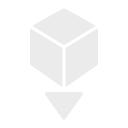 | Place one model at a time (`S`) |
| **Paint Area** | 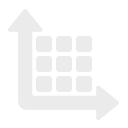 | Drag to fill a rectangular area (`P`) |
| **Grid Up** | 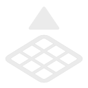 | Raise the active grid level (`Shift + W`) |
| **Grid Down** |  | Lower the active grid level (`Shift + S`) |
| **Fork** |  | Fork selec­ted model's textures (`Ctrl + F`) |

#### Subtoolbar

When models are selected or you are in placement mode, a **subtoolbar** appears in the top bar with these buttons:

| Button | Icon | Description |
|--------|------|-------------|
| **Rotate** |  | Rotate 90° on the current transform axis (`Space`). **Shift + click** for incremental rotation. |
| **Flip** |  | Flip (mirror) on the current transform axis (`F`) |
| **Transform Axis** | 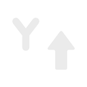 | Cycle the transform axis: Y → Z → X (`A`). Controls which axis Rotate and Flip operate on. Icon updates to show the active axis. |
| **Reset** |  | Reset orientation to default (`R`) |
| **Delete** |  | Delete selected models (`Delete`) |

### Selecting Models

When you are **not** in placement mode, click anywhere to interact with placed models:

| Action | Control |
|--------|---------|
| **Select** | Click a placed model |
| **Add / remove from selection** | `Shift + Click` a model |
| **Marquee select** | Click and drag on an empty area to draw a selection box |
| **Deselect all** | Click an empty area or press `Escape` |

### Placing Models

1. Select a model from the model palette (opens via  in the top bar)
2. Choose **Place Single**  (`S`) or **Paint Area**  (`P`) from the left toolbar
3. A **ghost preview** of the model follows your cursor on the grid
4. **Place Single**: Click to place one model. **Paint Area**: Click and drag to fill a rectangular region with the model.

The grid is **occupancy-aware** — each placed model occupies grid cells. Paint Area automatically skips cells that are already occupied. Models can be stacked on surfaces of previously placed models.

> **Tip**: Press `Escape` to exit placement mode and return to selection mode.

### Moving & Duplicating Models

Select a model to reveal the **Move Widget** — a 3D positioning handle. Drag the widget to reposition:

| Drag Mode | Result |
|-----------|--------|
| **Drag** | Grid-snapped move |
| **Shift + Drag** | Fine-snap move (sub-cell positioning using texel grid, ignores occupancy) |
| **Ctrl + Drag** | Duplicate the model at a new grid position |
| **Ctrl + Shift + Drag** | Duplicate with fine-snap positioning |

### Rotating & Flipping

Rotation and flipping operate around the current **Transform Axis**. The Transform Axis is independent of the Grid Axis and controls which world axis the operation uses.

| Action | Shortcut | Description |
|--------|----------|-------------|
| **Rotate 90°** | `Space` | Quarter-turn around the current transform axis |
| **Incremental Rotate** | `Shift + Space` | Rotate by a smaller angle (default 15°, configurable per-scene) |
| **Flip** | `F` | Mirror the model along the current transform axis |
| **Reset Orientation** | `R` | Return the model to its default orientation |
| **Cycle Transform Axis** | `A` | Change which axis Rotate/Flip use: Y → Z → X → Y |

### Grid System

The Scene Builder uses a grid for model placement. There are **two independent axis controls**:

#### Grid Axis

Controls which plane the placement grid sits on:

| Axis | Plane | Icon |
|------|-------|------|
| **Y** (default) | Horizontal floor |  |
| **Z** | Vertical wall (front/back) |  |
| **X** | Vertical wall (left/right) | 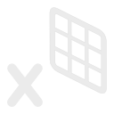 |

Cycle the grid axis using the **Grid Axis** button in the top bar. Each axis remembers its own grid level — switching axes restores the last-used level for that axis.

#### Grid Level

Raise or lower the placement plane within the current grid axis:

| Action | Shortcut |
|--------|----------|
| **Grid Up** | `Shift + W` |
| **Grid Down** | `Shift + S` |

Toggle grid visibility with `G`.

#### Transform Axis vs. Grid Axis

These are **separate** controls:

- **Grid Axis** — determines the *plane* where new models are placed (floor, wall, ceiling). Changed via the Grid Axis button in the top bar.
- **Transform Axis** — determines the *direction* that Rotate and Flip operate around. Changed with the `A` key or the axis button in the subtoolbar.

You can, for example, place models on a wall (Grid Axis = Z) while rotating them around the vertical axis (Transform Axis = Y).

### Per-Scene Settings

Each scene has configurable snapping settings, accessible from the tile hover menu () on the scene tile in the **Scenes** tab:

| Setting | Default | Description |
|---------|---------|-------------|
| **Height Step** | 1.0 | Distance per grid level step |
| **Texel Density** | 16 | Grid subdivisions per unit (affects fine-snap resolution) |
| **Incremental Rotation** | 15° | Angle used by `Shift + Space` and Shift + click on the Rotate button |

### Forking Models

**Fork** creates an independent copy of a model's textures, allowing you to paint unique variations without affecting the original:

1. Select one or more placed models
2. Press `Ctrl + F` or click the Fork button  in the left toolbar
3. A confirmation dialog lists every model that will be duplicated

When you fork multiple models at once, the selection is grouped by model type. All instances of the **same** source model share a single new fork, while each **different** model type gets its own fork. For example, forking three chairs and two tables creates one forked chair (used by all three instances) and one forked table (used by both instances).

> **Tip**: Without forking, all instances of the same model share textures — painting one changes them all. Fork when you want unique appearances.

### Entering Scene Painter

To paint models within your scene:

1. Click the  **Scene Painter** button in the left toolbar, or press **Tab**
2. The Scene Builder transitions to **Scene Painter** mode
3. Press **Tab** again to return to the Scene Builder

---

## Scene Painter

The Scene Painter lets you paint models directly within a scene, without leaving the scene context. All of the Model Painter's tools — brushes, eraser, fill, selections, layers, palettes — are available here.

### Opening the Scene Painter

From the **Scene Builder**, switch to Scene Painter by:

- Clicking  **Scene Painter** in the left toolbar
- Pressing **Tab**

### Differences from Model Painter

The Scene Painter has all the same tools, layers, and palette features as the Model Painter, plus a **Fork** button  at the bottom of the tool panel. Two features from the Model Painter are **not** available in Scene Painter:

-  **Explode** — not supported in scene context
-  **Focus Mode** — not supported in scene context

### Forking in Scene Painter

Fork works as a **toggle mode** in Scene Painter:

1. Press `Ctrl + F` or click  at the bottom of the tool panel
2. A sticky toast appears: "Click on a model to fork"
3. Hover over models to see an outline highlight
4. Click a model to fork it — a confirmation dialog appears

Click empty space to cancel fork mode without forking.

### Returning to Scene Builder

Press **Tab** or click the  back arrow (home button) to return to the Scene Builder.

---

## Exporting Your Work

Share your painted models by exporting them as textures or 3D files. You can export a single model or multiple models at once.

### Export Screen

1. Select one or more models in the Models tab
2. Tap  in the selection toolbar, then  **Export** (or use **Export** from a tile's hover menu for a single model)
3. The Export screen shows all selected models with their materials, resolutions, and layer counts
4. Configure export options:

| Option | Description |
|--------|-------------|
| **Merge Layers** | When on (default), all layers are flattened into a single texture per material. When off, each layer is exported as a separate PNG. |
| **Export Models** | When on, exports 3D model files alongside textures. When off, exports only texture images. |
| **Format** | Choose the 3D format when Export Models is on: GLTF, OBJ, or BBModel |
| **Zip Exports** | When on, each model's output is bundled into a ZIP archive. When off, output goes into a subfolder per model. |

5. Tap **Export** — a folder picker opens to choose the output directory
6. If output files already exist, a **File Conflict** dialog appears with options to **Rename** (auto-rename new files) or **Overwrite** existing files

### Export Formats

| Format | Best For |
|--------|----------|
| **GLTF** | Web, game engines, universal compatibility |
| **OBJ** | Most 3D software |
| **BBModel** | Blockbench (preserves layers!) |

---

## Snapshot & Share

Capture images of your painted models and scenes to share with others.

### Taking a Snapshot

1. Tap  **Snapshot** (available from the tile hover menu in the Models or Scenes tab)
2. The Snapshot screen appears with a preview and options

### Snapshot Options

| Option | Description |
|--------|-------------|
| **Format** | PNG (transparent background) or JPG (solid background) |
| **Resolution** | Set the output image resolution |
| **Background** | Choose a solid background color (JPG) or transparent (PNG) |
| **Show Grid** | Toggle grid overlay visibility in the snapshot |
| **Animate** | Toggle turntable animation for animated GIF/video export |
| **Camera** | Adjust the camera angle and zoom for the snapshot |
| **Rendering** | Switch between rendering styles |

### Saving & Sharing

- Tap **Save** to save the snapshot to your file system
- Tap **Copy** to copy the image to your clipboard
- Use `Ctrl + PrintScreen` from the Model Painter to quickly copy a 4K screenshot to your clipboard

---

## Decal Library

Decals are pre-made images you can stamp onto your models — perfect for eyes, faces, patterns, and details.

### Accessing the Decal Library

- **Stamp Tool** () in the Model Painter — opens in stamp mode (select a decal to use it)
- **Menu > Decal Library** in the Models tab — opens in browse-only mode (manage your decals without stamping)

### Using Decals (Stamp Mode)

1. Select the **Stamp Tool** () in the Model Painter
2. The Decal Library opens
3. Click a decal to select it, then tap  **Copy to Clipboard** (or double-click a decal to copy it directly)
4. The overlay closes and a toast appears: "Click Face to Paste To"
5. Click on a face to place the decal

### Managing Decals

Decals are displayed in a flat grid — no categories or folders. All the same tile management patterns apply:

| Action | How |
|--------|-----|
| Import decals | Tap  **Import Decal** to select one or more image files |
| Rename a decal | Hover over a tile and tap  then  **Rename** |
| Export decals | Select, tap  in the selection toolbar, then  **Export** |
| Delete decals | Select, tap  in the selection toolbar, then  **Delete** |
| Reorder decals | Select and use  **Move Forward** /  **Move Backward** in the selection toolbar |
| Multi-select | `Ctrl + Click` to toggle, `Shift + Click` for range, or drag to marquee select |
| Toggle view | Tap the view toggle button to switch between grid and compact view |

---

## Palette Manager

The Palette Manager is a full-featured color palette editor with three panels.

### Accessing the Palette Manager

- From the **Models tab**: Menu > **Edit Palettes**
- From **Model Painter**: Tap the  **Edit Palette** button

### Layout

| Column | Contents |
|--------|----------|
| **Palette List** (left) | List of palette names with Built-in / Custom tabs at the bottom |
| **Color Grid** (center) | Grid of color swatches for the selected palette |
| **Color Picker** (right) | HSV picker, RGBA sliders, hex input, and color preview |

### Palette Tabs

At the bottom of the palette list, two tabs filter which palettes are shown:

- **Built-in** — Pre-made palettes that come with the app (read-only)
- **Custom** — Your own palettes that you can freely edit

> **Note**: Built-in palettes cannot be modified directly. If you attempt to edit a color in a built-in palette, a copy is automatically created in your Custom tab.

### Managing Palettes

Use the  menu button in the palette list header to access palette actions:

| Action | Menu Item |
|--------|-----|
| Create palette |  **New Palette** |
| Rename palette |  **Rename Palette** (custom palettes only) |
| Duplicate palette |  **Duplicate Palette** |
| Import palette |  **Import Palette** |
| Export palette |  **Export Palette** |
| Delete palette |  **Delete Palette** (custom palettes only) |

### Editing Colors

With a custom palette selected, tap a color swatch in the center grid to edit it:

1. Use the **HSV picker square** to adjust saturation and brightness
2. Use the **Hue slider** to change the hue
3. Adjust individual channels with the **RGBA sliders** (0–255), including alpha for transparency
4. Enter a **hex code** directly in the hex field
5. The **color preview swatch** shows the current color with a transparency pattern behind it

Use the  menu button in the color grid header to add or remove colors:

| Action | How |
|--------|-----|
| Add color |  **Add Color** — adds a copy of the selected color (or white if none selected) |
| Remove color |  **Remove Color** — removes the selected swatch (requires confirmation) |
| Reorder colors | Use the swap left/right buttons in the color grid toolbar (dragging is not supported) |

### Importing Palettes

Supported import formats (max 512 colors):
- **PNG** — Colors sampled from image pixels
- **JASC PAL** — Paint Shop Pro format
- **ASE** — Adobe Swatch Exchange
- **GPL** — GIMP Palette
- **HEX** — Plain text hex codes (one per line)

### Exporting Palettes

Palettes are exported as **.hex** files (one hex color per line). Use  **Export Palette** from the palette menu to save to disk.

---

## Settings

Customize Draw on a Block to fit your workflow.

### Display Settings

| Setting | Description |
|---------|-------------|
| **Cavity Shading** | Edge highlighting effect strength |
| **Matcap Intensity** | Lighting style intensity |
| **Rim Shadow** | Edge darkening effect |
| **Grid Colors** | Customize texel grid overlay colors |
| **Checkerboard** | Transparency indicator colors |

### Control Settings

| Setting | Description |
|---------|-------------|
| **Rotation Sensitivity** | Camera orbit speed |
| **Zoom Sensitivity** | Scroll zoom speed |
| **Pan Sensitivity** | Camera pan speed |
| **Double-Click Threshold** | Time window for double-click detection |

### Presets

- **UV Resolutions**: Customize available resolution options

### Hotkeys

Customize keyboard shortcuts for all tools and actions. See [Keyboard Shortcuts](#keyboard-shortcuts-pc) for defaults.

---

## Keyboard Shortcuts (PC)

All shortcuts can be customized in **Settings > Hotkeys**.

### General

| Action | Default |
|--------|---------|
| Undo | `Ctrl + Z` |
| Redo | `Ctrl + Y` or `Ctrl + Shift + Z` |
| Copy | `Ctrl + C` |
| Cut | `Ctrl + X` |
| Paste | `Ctrl + V` |
| Delete Selection | `Delete` |
| Cancel / Go Back | `Escape` |
| Approve / Commit | `Enter` |
| Zoom In | `Ctrl + +` |
| Zoom Out | `Ctrl + -` |
| Toggle Grid | `G` |
| Toggle Explode | `E` |
| Toggle Rotation Snap | `S` |
| Open Layer Window | `L` |
| Focus Mode | `Ctrl + H` |
| Help Mode | `F1` |
| Color Picker (Hold) | `Alt` *(not customizable)* |
| Copy 4K Screenshot | `Ctrl + PrintScreen` |

### Paint Tools

| Tool | Default |
|------|---------|
| Magic Wand | `Ctrl + W` |
| Selection | `Ctrl + S` |
| Brush | `Ctrl + P` |
| Spray Paint | `Ctrl + A` |
| Line | `Ctrl + L` |
| Pen Eraser | `Ctrl + E` |
| Face Eraser (Scrub Brush) | `Ctrl + Shift + E` |
| Fill | `Ctrl + F` |
| Replace Color | `Ctrl + Shift + F` |
| Linear Gradient | `Ctrl + G` |
| Radial Gradient | `Ctrl + Shift + G` |
| Blend Brush | `Ctrl + B` |
| Blend Line | `Ctrl + Shift + B` |
| Stamp (Decals) | `Ctrl + D` |
| Rectangle (Hollow) | `Ctrl + R` |
| Rectangle (Solid) | `Ctrl + Shift + R` |
| Circle (Hollow) | `Ctrl + O` |
| Circle (Solid) | `Ctrl + Shift + O` |

### Selection Modifiers

| Action | Keys |
|--------|------|
| Add to Selection | `Shift + Click` (drag or Magic Wand) |
| Subtract from Selection | `Ctrl + Click` (drag or Magic Wand) |

### Selection Transforms

| Action | Default |
|--------|---------|
| Flip Horizontal | `Shift + H` |
| Flip Vertical | `Shift + V` |
| Rotate CCW (90°) | `Shift + Q` |
| Rotate CW (90°) | `Shift + W` |
| Move Up (1px) | `↑` |
| Move Down (1px) | `↓` |
| Move Left (1px) | `←` |
| Move Right (1px) | `→` |
| Move Up (8px) | `Shift + ↑` |
| Move Down (8px) | `Shift + ↓` |
| Move Left (8px) | `Shift + ←` |
| Move Right (8px) | `Shift + →` |

### Scene Builder

| Action | Default |
|--------|---------|
| Switch to Scene Painter | `Tab` |
| Rotate Model (90°) | `Space` |
| Incremental Rotate | `Shift + Space` |
| Flip Model | `F` |
| Reset Orientation | `R` |
| Cycle Transform Axis | `A` |
| Place Single | `S` |
| Paint Area | `P` |
| Grid Up | `Shift + W` |
| Grid Down | `Shift + S` |
| Toggle Grid | `G` |
| Fork Model | `Ctrl + F` |
| Reset Camera | `H` |

### Scene Painter

| Action | Default |
|--------|---------|
| Switch to Scene Builder | `Tab` |
| Fork Model | `Ctrl + F` |

---

## Troubleshooting & FAQ

### Common Issues

**Q: My painted changes disappeared!**  
A: Check that you're painting on the correct layer. Hidden layers won't show your work. Your work is auto-saved periodically. If you return to the Models tab, your model's texture changes are saved automatically.

**Q: I can't paint on certain faces.**  
A: Check the following:
- Is the layer visible? Hidden layers can't be painted on.
- Do you have an active selection? Painting is confined to the selected area.

**Q: Colors look different when exported.**  
A: This is usually due to color space differences. Try exporting as PNG with the "sRGB" option if available in your target software.

**Q: Import isn't working.**  
A: Ensure your model file:
- Is a supported format (FBX, OBJ, GLTF, GLB, BBModel)
- Has valid UV mapping
- Isn't corrupted or password-protected
- Has its textures in the same folder as the model file (textures must be accessible)

### Getting Help

- **In-App Help**: Tap  in the Model Painter
- **Report Bugs**: Menu > **Report Bug** 
- **This Guide**: Menu > **User Guide**

### Contact

For additional support, visit our GitHub repository or community forums.

---

*Thank you for using Draw on a Block! Happy painting! 🎨*
